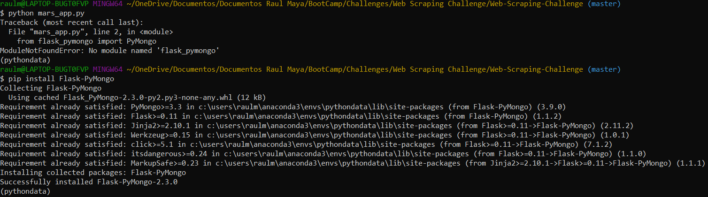

<h1><u>Mars Mission</u></h1>

### <u>Background</u>
The user needs an app, that scrapes various websites for data related to the Mission to Mars and shows the information in a HTML page.
 

The web pages that the user demand to make the scraping of are the following:
1. https://redplanetscience.com
 

2. https://spaceimages-mars.com
 

3. https://galaxyfacts-mars.com
 

4. https://marshemispheres.com
 

### <u>Tools</u>
* Python
* BeautifulSoup
* Splinter
* Web Driver Manager
* Pymongo
* Mongo DB
* Jupyter Notebook
* Visual Studio Code

### <u>How does the app work?</u>

#### 
Installing Complements

   - Installing Flask Pymongo
    * Code: pip install Flask-PyMongo
    

   - Installing BeautifulSoup
    * Code: pip install beautifulsoup4
    

   - Installing Splinter
    * Code: pip install Splinter
    

   - Installing Web-Driver Manager
    * Code: pip install webdriver-manager
    

   - Installing Lxml
    * Code: pip install lxml
    

#### 
Running the App

1. Open your terminal so you can run your app. Run it with the following code "python 'name_of_your_app.py'", for example my app is called "mars_app.py", so to run the app, the code in the terminal will be: "python mars_app.py". If everything is working correctly the terminal will output a https address: "http://127.0.0.1:5000/"

 

2. When you open the http address http://127.0.0.1:5000/ in the browser, the starting page will run a default scrape, and will store the values in the home page.

 

3. To scrape new values so that the home page refresh, with new data, we need to click in the button: "Scrape New Data".

  
 

4. When the user click on the "Scrape New Data" button, the program will make the calls and start scraping the selected web pages, and storing the information into a Mongo DB.

 

  
 

5. The data stored in Mongo DB will power the new html page, with images, texts, tables, and headlines.

 

### <u>Contact</u>
* Name: Raul Maya Salazar
* Phone: +52 833 159 7006
* E-mail: raulmayas20@gmail.com
* GitHub: https://github.com/RaulMaya
* LinkedIn: https://www.linkedin.com/in/raul-maya/
